# Power Inverter Firmware
  The power inverter circuit schematic is shown below in **Figure 1**. The circuit was not designed by me; I was only responsible for the microcontroller programming.
  
  

  <b>Figure 1. Power Inverter Circuit Schematic</b> 
  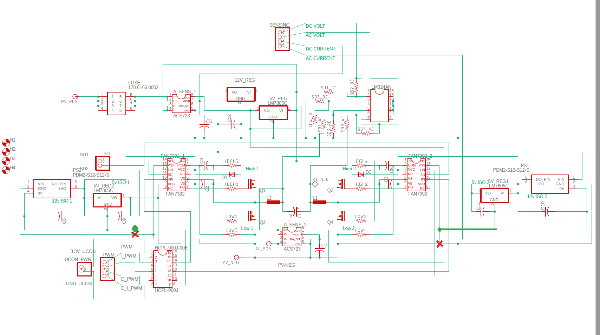

  
  The control logic and signaling required for the inverter circuit to function properly were implemented on a Texas Instruments TMS320F28335 microcontroller. The firmware was programmed in C using TI’s Code Composer Studio IDE. The basic components of the firmware were a main source file, several peripheral initialization source files, a source file for interrupt service routines (ISRs), and header files to link the source files together.

  The main source file (main.c) began with definitions for global variables and constants, then entered the main function and proceeded to call functions to initialize the required GPIO, PWM, and ADC peripheral modules. A function call to initialize interrupts through the peripheral interrupt expansion (PIE) block was also executed. Every initialization function used in the main source file was defined in its own corresponding source file (i.e. gpio_init.c, PWM_init.c, adc_init.c, and interrupt_init.c). Once the peripherals and interrupts were set up, the main function entered an endless loop of NOP instructions. Essentially, the main function was only used to setup and enable peripheral modules, and all of the control logic and user interface response was handled by interrupt service routines.

  The gpio_init.c source file contained the code used to set the MCU’s physical GPIO pins to our desired functionality. The pins are controlled through the registers of the GPIO MUX shown below in **Figure 2**.

  <b>Figure 2. GPIO Multiplexing Diagram</b> 
  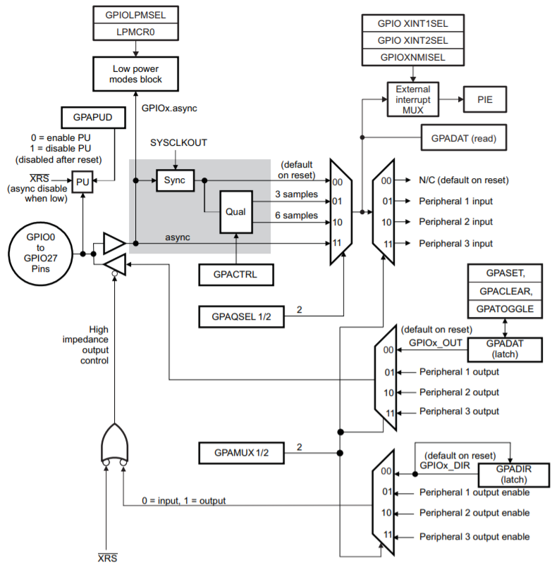

  The GPAMUX1 register was used to set GPIO pins 00, 01, 02, and 03 as PWM outputs (Peripheral 1). These PWM pins were used to provide control signals to the H-bridge gate driver chips.  GPAMUX1 was also used to set pins 04, 05, 07, 08, 09, and 32 to function as digital I/O. The GPADIR register was used to set pins 04, 05, and 32 as inputs and pins 07, 08, and 09 as outputs. For the digital inputs, the GPAPUD register was used to enable internal pull-up resistors on the pins. Since the inputs were connected to buttons/switches on the user interface board, signal debouncing was required. This was accomplished by setting a sampling window on the input signals through the GPAQSEL1 and GPACTRL registers. Additionally, the output pins were latched to an initial low value through the GPACLEAR register. 
  
  The PWM_init.c source file contained the code used to set all the initial parameters of the PWM peripheral. The structure of the PWM peripheral and its submodules can be seen in **Figure 3**.

  <b>Figure 3. PWM Peripheral Diagram</b> 
  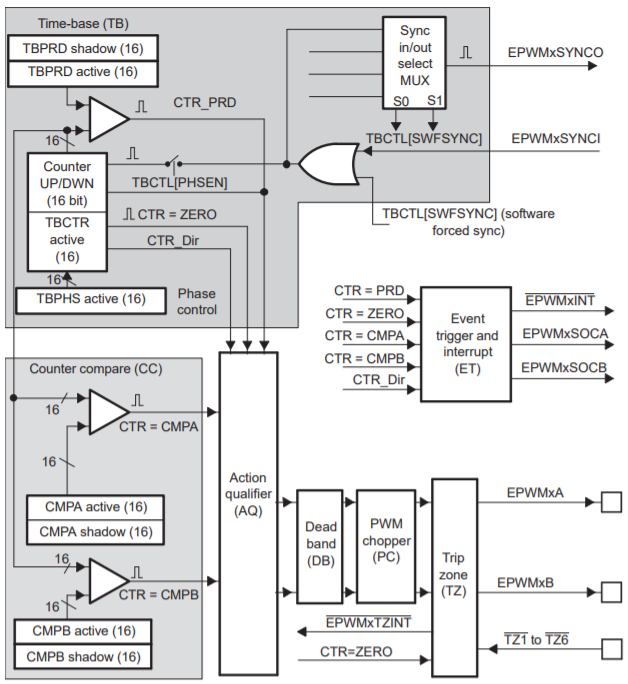

  
  The MCU had 6 independent PWM modules; we required the use of 2 for this project. Each module had 2 usable outputs: EPWMxA and EPWMxB. GPIO pins 00 and 01 were tied to the outputs EPWM1A and EPWM1B, while pins 02 and 03 were linked to outputs EPWM2A and EPWM2B. The module EPWM1 was set to work in up-count mode through the TBCTL register. The PWM signal period was set through the TBPRD register. The period is specified in terms of clock cycles; this value was calculated with the equation TBPRD = ((CLK_FREQ / PWM_FREQ) - 1), where CLK_FREQ = 150 MHz and PWM_FREQ = 50 kHz. The duty cycle was set through the CMPA register, which was assigned a value by calling a function named dutyCyc. The dutyCyc function calculated its return value with the equation CMPA = ( 0.5 + amplitude\*sin(2\*PI\*60\*(count / PWM_FREQ)) )\*(TBPRD), where amplitude was a variable used to control the inverter’s output voltage, and count was a variable which increments every time a period of the PWM signal is complete and resets to zero when it equals TBPRD - 1.

  It should be noted that the amplitude variable in the previous equation has a maximum value of 0.3 and a minimum value of 0. The AQCTLA register was used to set EPWM1A to latch high when the TBCTR equals zero and latch low when the TBCTR equals CMPA. Similarly, the AQCTLB register was used to set EPWM1B to latch low when the TBCTR equals zero and latch high when the TBCTR equals CMPA. This means that the signal from EPWM1B was the inverse of EPWM1A. A 300 ns switching deadband was then specified using the DBRED and DBFED registers. The ETSEL register was used to make the EPWM1 module generate an interrupt signal every time TBCTR equals TBPRD. The ETSEL register also was used to enable the start-of-conversion (SOCA) signal. This SOCA signal is used by the ADC peripheral to trigger a sample and conversion of its analog inputs. PWM module EPWM2 was set up the same as EWPM1 except that its interrupt and SOCA signals were not enabled, and EPWM2A and EPWM2B were made to be the inverses of EPWM1A and EPWM1B, respectively.

  The adc_init.c source file contained the code used to specify which ADCIN pins would be used by the ADC module and what signal would be used as its sample trigger. The ADCTRL2 register was used to allow the ADC module to accept the SOCA signal from EPWM1 as its trigger. The number of signal conversions was set to 4 through the ADCMAXCONV register. Then the 4 channels (i.e. pins) to sequence were selected with the ADCCHSELSEQ1 register. The pins chosen were ADCINA0 (input voltage), ADCINA1(input current), ADCINA2 (output voltage), and ADCINA3 (output current). A diagram representing the ADC module can be seen in **Figure 4**.

  <b>Figure 4. ADC Module</b> 
  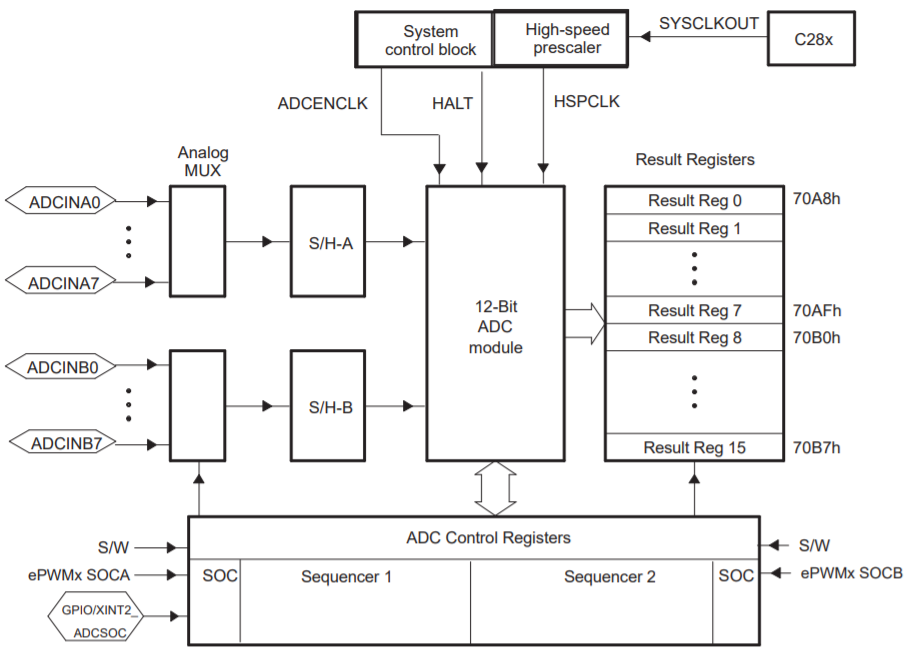

  
The interrupt_init.c source file contained the code used to assign ISRs to the PIE vector table, assign pins to interrupts in the PIE block, and configure the triggering behavior of those interrupts. **Figure 5** shows a diagram of the PIE block, and **Figure 6** shows the multiplexing scheme of the possible interrupt sources.

  <b>Figure 5. PIE Block</b> 
  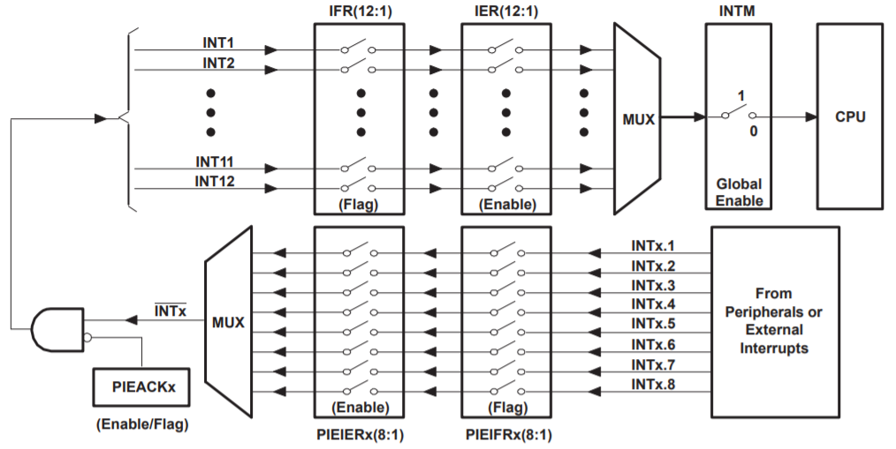

  

  <b>Figure 6. PIE Interrupt Source Diagram</b> 
  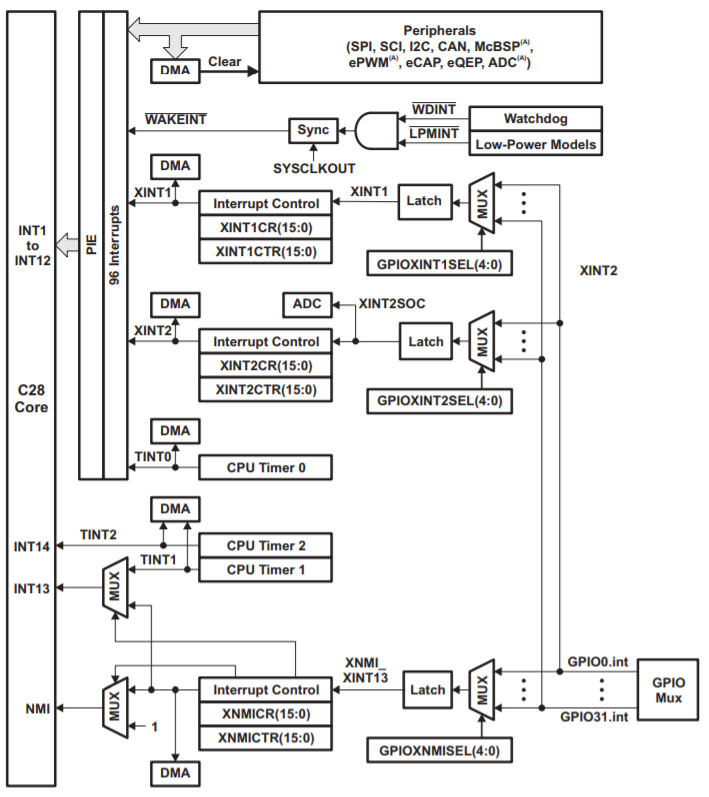

  
  The PIE vector table was populated with 4 ISRs: XINT1 with the ISR for when the power switch is toggled, XINT2 with the ISR for when the up button is pressed, XINT3 with the ISR for when the down button is pressed, and XINT4 with the ISR for when the interrupt from the EPWM1 module occurs. Then the PIE block and PIE interrupts were enabled through the PIECTRL and PIEIER registers. GPIO pins 04, 05, and 32 were selected to be the external interrupts XINT1, XINT2, and XINT3 through their respective GPIOXINTxSEL registers. Using the XINT1CR, XINT2CR, and XINT3CR registers, XINT1 was set to trigger on both its rising and falling edge, while XINT2 and XINT3 were set to be falling edge triggered.  

  Finally, the ISRs.c source file contained the function definitions for the interrupt service routines entered into the PIE vector table. The first ISR function handles the interrupt that  occurs when the power switch is toggled. If the power switch is in the on position, the green LED is turned on and the clock signal to the PWM modules is enabled. In contrast, if the power switch is in the off position, the green LED is turned off and the clock to the PWM modules is disabled. The second ISR specifies what happens when the interrupt from EPWM1 occurs. This ISR either increments the global variable named count or resets it to zero if count equals TBPRD – 1. Additionally, it recalculates and sets the duty cycle for both EPWM1 and EPWM2. It also checks the value of the variable named amplitude and turns on the blue LED to indicate that the inverter is currently at its maximum output voltage. The last two ISRs handle what happens when either the up button or the down button of the user interface is pressed. If the up button is pressed, then the value of the variable named amplitude is increased by 0.03. Similarly, if the down button is pressed, the value of amplitude is decreased by the same amount. If both buttons are held at the same time, the value of amplitude is set to its maximum (0.30). 

  The user interface board can be seen in **Figure 7**, where the leftmost button is the up button, the button to the right of it is the down button, and the toggle switch on the right is the power switch. Also, the leftmost LED is green and the rightmost one is blue. The red LED in the middle is unused.

  <b>Figure 7. User Interface</b> 
  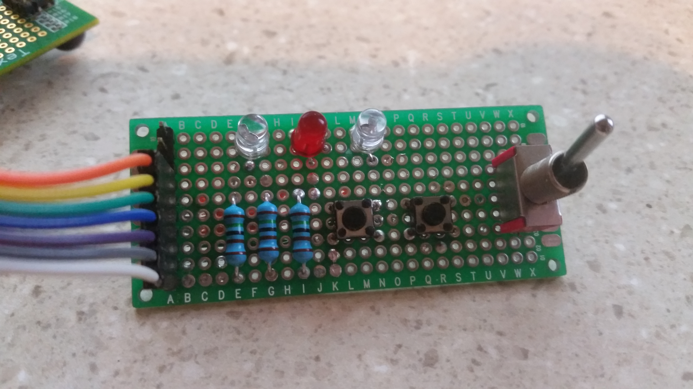

  
The PWM signals from the MCU were tested on an oscilloscope. The waveforms in **Figure 8** shows that the two signals from either PWM module were indeed compliments of each other (i.e. EPWMxA and EPWMxB). The same was true for corresponding signals from the two different PWM modules in use (i.e. EPWM1x and EPWM2x).

  <b>Figure 8. Oscilloscope Screenshot #1</b> 
  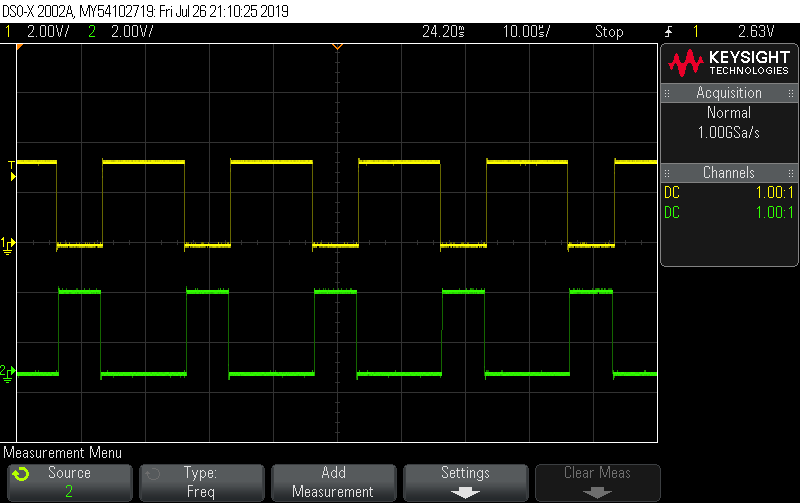

  
**Figure 9** and **Figure 10** confirm that the rising edge and falling edge switching deadband time were 300 ns. This was important because without an appropriate deadband period, the H-bridge portion of the inverter circuit could intermittently behave as a direct short to ground.

  <b>Figure 9. Oscilloscope Screenshot #2</b> 
  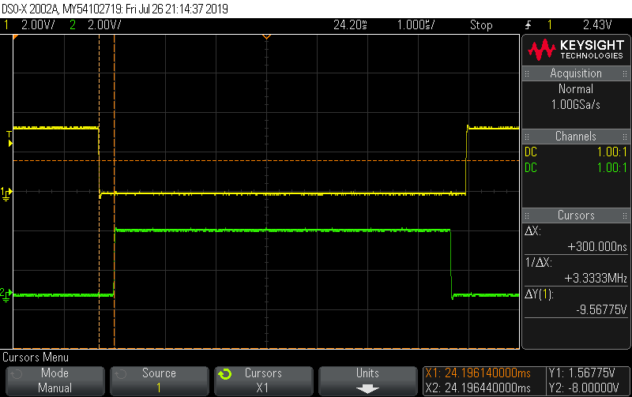

  

  <b>Figure 10. Oscilloscope Screenshot #3</b> 
  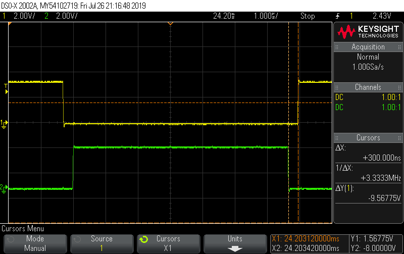

  
  **Figure 11** shows what happened when the PWM signals were sent through a low-pass LC filter. As the waveforms show, the results were two sinusoidal signals (the yellow and green traces) with a 60Hz frequency and 180-degree phase difference. To simulate the behavior of the H-bridge circuit, the math function was used to subtract signal 2 from signal 1; the resulting trace is the purple colored one.
  

  <b>Figure 11. Oscilloscope Screenshot #4</b> 
  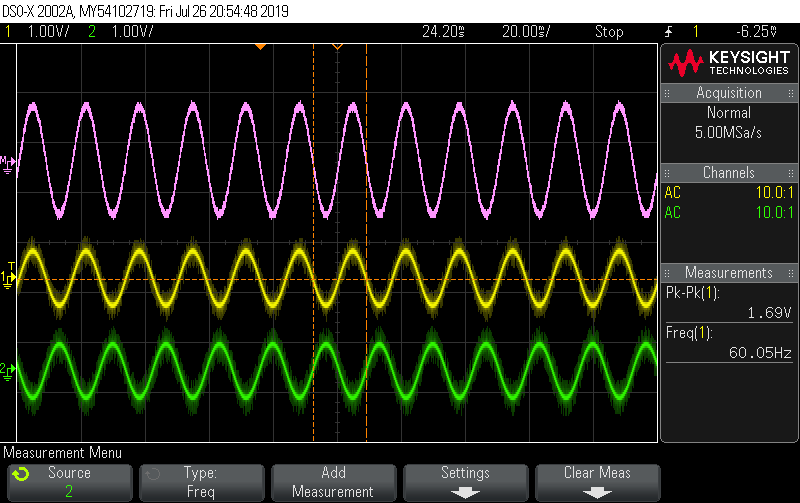

